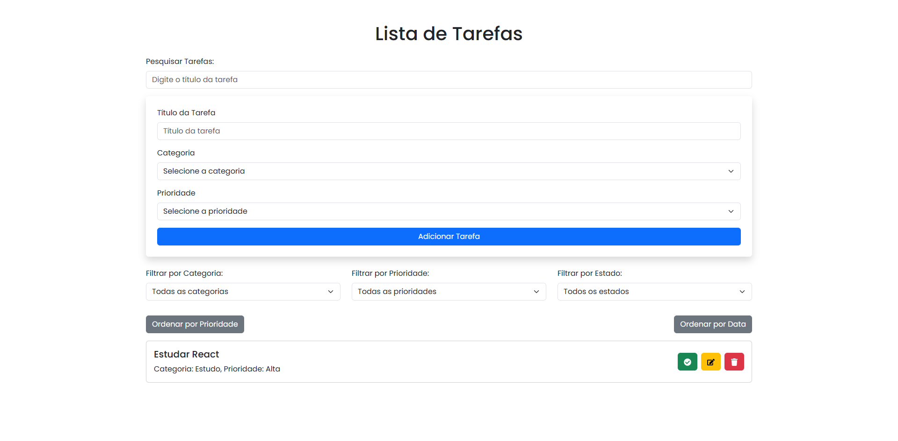

# Task Manager

O **Task Manager** é uma aplicação web simples para gerenciar suas tarefas diárias. Com suporte a categorias, prioridades, filtros, pesquisa e estatísticas, esta ferramenta ajuda você a organizar sua lista de tarefas de forma eficiente.

## Funcionalidades

- **Adicionar Tarefas:** Insira novas tarefas com título, categoria e prioridade.
- **Marcar como Concluída:** Marque tarefas como concluídas ou reabra-as se necessário.
- **Editar Tarefas:** Altere os detalhes de uma tarefa existente.
- **Excluir Tarefas:** Remova tarefas indesejadas.
- **Filtrar por Categoria, Prioridade e Estado:** Organize suas tarefas por categoria, prioridade ou estado (concluídas/pendentes).
- **Pesquisa de Tarefas:** Encontre rapidamente tarefas pelo título.
- **Persistência de Dados:** Suas tarefas são salvas automaticamente no navegador usando `localStorage`.
- **Ordenação:** Ordene as tarefas por prioridade ou data de criação.

## Demonstração



## Como Executar o Projeto

### Pré-requisitos

- Node.js (versão 14 ou superior)
- npm (geralmente instalado junto com o Node.js)

### Passos

1. **Clone o Repositório:**
   ```bash
   git clone https://github.com/thejessemartins/task-manager.git
   cd task-manager
   ```

2. **Instale as Dependências:**
   ```bash
   npm install
   ```

3. **Inicie o Servidor de Desenvolvimento:**
   ```bash
   npm run dev
   ```

4. **Acesse o Aplicativo:**
   Abra [http://localhost:5173](http://localhost:5173) no seu navegador.

## Tecnologias Utilizadas

- **Framework:** React.js
- **Biblioteca de UI:** Bootstrap
- **Gerenciador de Estado:** useState (React Hooks)
- **Build Tool:** Vite
- **Ícones:** React Icons
- **Persistência de Dados:** LocalStorage

## Estrutura do Projeto

```
src/
├── components/
│   ├── TaskForm.js         # Formulário para adicionar/editar tarefas
│   ├── TaskList.js         # Lista de tarefas
│   ├── TaskItem.js         # Item individual da lista
│   ├── CategoryFilter.js   # Filtro por categoria
│   ├── PriorityFilter.js   # Filtro por prioridade
│   ├── StatusFilter.js     # Filtro por estado
│   ├── SearchBar.js        # Barra de pesquisa
│   └── TaskStats.js        # Estatísticas das tarefas
├── App.js                  # Componente principal
└── index.css               # Estilos globais
```

## Contribuição

Contribuições são bem-vindas! Sinta-se à vontade para abrir issues ou enviar pull requests.

1. Faça um fork do repositório.
2. Crie uma branch para sua feature (`git checkout -b minha-feature`).
3. Faça commit das suas alterações (`git commit -m "Adiciona nova funcionalidade"`).
4. Envie para a branch (`git push origin minha-feature`).
5. Abra um pull request.

## Licença

Este projeto está licenciado sob a Licença MIT. Consulte o arquivo [LICENSE.md](LICENSE.md) para mais detalhes.

## Autor

- **João Silva** - [GitHub](https://github.com/thejessemartins) | [LinkedIn](https://www.linkedin.com/in/jess%C3%A9-martins-boeira-8b98381b3/)

---

Se você tiver dúvidas ou sugestões, sinta-se à vontade para entrar em contato!

